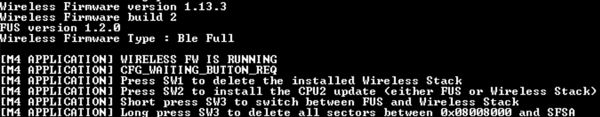

# STM32WB FUS Command Line Interface 

## FUS CLI example

This example shows how to interact with FUS using FUS commands in order to perform some actions:
  * Upgrade the current Wireless Stack or FUS 
  * Delete the installed Wireless Stack
  * Switch between FUS and Wireless Stack

## Hardware setup

This example runs on [P-NUCLEO-WB55.Nucleo](https://www.st.com/en/evaluation-tools/nucleo-wb55rg.html) board.

## How to use it ?

This application is compatible with all wireless coprocessor binary.
All available binaries are located under /Projects/STM32_Copro_Wireless_Binaries directory.

In order to make the program work, you must do the following:
 * Open your toolchain 
 * Rebuild all files and flash the board with the executable file at 0x08000000
 * Or use the FUS_CLI_reference.bin firmware image from Binary directory (STM32WB-FUS-Command-Line-Interface\Projects\P-NUCLEO-WB55.Nucleo\Applications\BLE\FUS_CLI\Binary) and flash the binary at 0x08000000
 * Run the application

On the Nucleo board side:
 * Power on the Nucleo board with the FUS_CLI application

On the PC side:
 * Open a terminal window with the following settings:

   * Baudrate of 115200
   * Byte size of 8
   * Parity None
   * Stop bits 1
   * Data Flow Control None

 Once the board is flashed, the application displays wireless FW versions and the possible actions on hyperterminal like this:
   * Short press SW1 to delete the installed Wireless Stack
   * Short press SW2 to install the CPU2 update (either FUS or Wireless Stack)
   * Short press SW3 to switch between FUS and Wireless Stack
   * Long press SW3 until blue LED is ON and then release SW3 to delete all sectors between 0x08008000 and SFSA

There is also LED indication:
 * When the wireless stack is running, the green led flashes slowly
 * When the FUS is running, the green led flashes quickly
 * When an upgrade is on going, deleting the wireless stack or deleting the user flash memory, the blue led is on 
 * When there is an error, the red led is on 

In order to perform a FUS or a Wireless Stack Firmware update:
 * Download the wireless stack or the FUS image from www.st.com or from the STM32CubeMX repository
 * Long press on SW3 until blue LED is ON and then release SW3 to delete all flash sectors between 0x08008000 and SFSA
 * Sectors are deleted when the blue LED is OFF
 * Write the FW image in the user Flash memory at an address between 0x08008000 (end of application address) and the secure part (see SFSA option byte) minus the image size using erase and programming tab of STM32CubeProgrammer. Image start address must be aligned to sector start address (this is a multiple of 4-kbytes).
 * Reset the board thanks to a short press on reset button SW4   
 * Short press on SW2 to install the CPU2 update
   * For wireless stack update:
	 * If there is no wireless stack installed, the new FW will be installed at the download address.
	 * If there is already a wireless stack, the new FW will be installed at the optimal address
 * Firmware is updated when the blue LED is OFF

For more details refer to the Application Note: 
  * AN5185 - ST firmware upgrade services for STM32WB Series

Available Wiki pages:
  * [Bluetooth® LE_overview](https://wiki.st.com/stm32mcu/wiki/Connectivity:BLE_overview) 
  * [STM32WB Firmware Upgrade Service](https://wiki.st.com/stm32mcu/wiki/Connectivity:STM32WB_FUS) 
  * [STM32WB Bluetooth® LE – Wireless Stack Information](https://wiki.st.com/stm32mcu/wiki/Connectivity:STM32WB_BLE_Wireless_Stack)

## Troubleshooting

**Caution** : Issues and the pull-requests are **not supported** to submit problems or suggestions related to the software delivered in this repository. The STM32WB-FUS-Command-Line-Interface example is being delivered as-is, and not necessarily supported by ST.

**For any other question** related to the product, the hardware performance or characteristics, the tools, the environment, you can submit it to the **ST Community** on the STM32 MCUs related [page](https://community.st.com/s/topic/0TO0X0000003fOMWAY/stm32wb).
